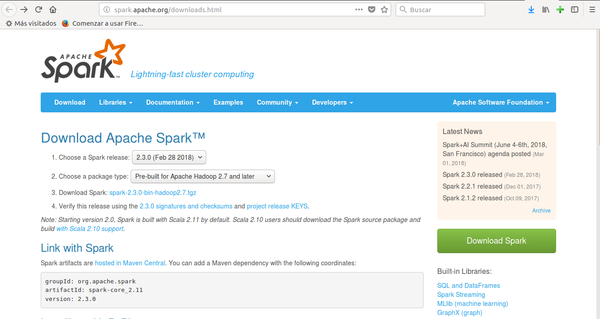
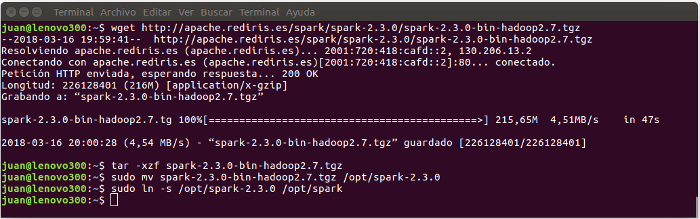
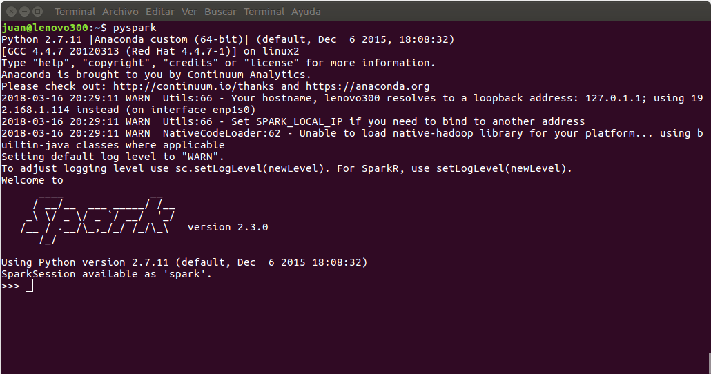

# Instalar Apache Spark

Vamos a instalar la última versión de Apache Spark en un sistema operativo Ubuntu 16.04 (XeniqAL).

En primer lugar vamos a descargar la última versión de Apache Spark desde su página oficial. Podemos hacerlo directamente haciendo click sobre el enlace de desarga, o por línea de comando mediante _wget_ y la url de dicho enlace.

La url de la página principal de descargas de Apache Spark es:

[http://spark.apache.org/downloads.html](http://spark.apache.org/downloads.html)

La url del paquete de la versión actual de Spark (2018-03-17):

[http://apache.rediris.es/spark/spark-2.3.0/spark-2.3.0-bin-hadoop2.7.tgz](http://apache.rediris.es/spark/spark-2.3.0/spark-2.3.0-bin-hadoop2.7.tgz)



Después de descargar el archivo con la última versión de Spark, lo descomprimiremos y moveremos el directorio resultante a su ubicación final. Por último crearemos un enlace simbólico para simplificar el acceso y abstraernos del número de versón; de este modo podremos tener instaladas distintas versiones y apuntar a la que más nos convenga en cada momento.

```
# Descargar la última versión de Apache Spark
wget http://apache.rediris.es/spark/spark-2.3.0/spark-2.3.0-bin-hadoop2.7.tgz

# Descomprimir el fichero
tar -xzf spark-2.3.0-bin-hadoop2.7.tgz

# Mover el directorio de instalación a su ubicación definitiva
sudo mv spark-2.3.0-bin-hadoop2.7.tgz /opt/spark-2.3.0

# Crear un link (enlace simbólico) a la instalación de Spark
sudo ln -s /opt/spark-2.3.0 /opt/spark
```




A continuación debemos indicar a nuestro intérprete de comandos bash dónde encontrar la aplicación, y para ello creamos la variable de entorno _SPARK_HOME_ y modificamos _PATH_:
```
export SPARK_HOME=/opt/spark
export PATH=$SPARK_HOME/bin:$PATH
```

Ahora sólo nos falta ejecutar la consola y ponernos a trabajar...

```
# Abir la consola de Python para Spark
pyspark
```



Como podemos ver en la imagen en la cabecera nos indica, entre otras cosas, las versiones de Spark y de Python.

## Referencias

[Get Started with PySpark and Jupyter Notebook in 3 Minutes](https://blog.sicara.com/get-started-pyspark-jupyter-guide-tutorial-ae2fe84f594f)


