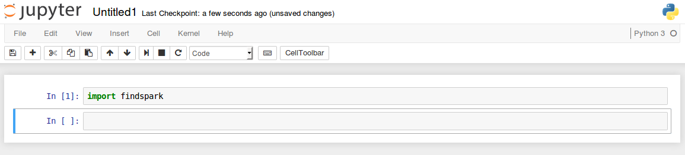

# Instalar Jupyter Notebook y usarlo con Python y Spark 

En este artículo veremos cómo utilizar Apache Spark y Python con Jupyter Notebook.

Como punto de partida consideraremos que tenemos una máquina con S.O. Ubuntu 16.04 (Xenial) en la que ya se encuentran instalados Java JDK 1.7 ó posterior, Apache Spark y Python y su gestor de paquetes pip.

Jupyter Notebook es una aplicación web que permite crear y compartir documentos que pueden contener tanto código fuente como visualizaciones, ecuaciones y texto explicativo. Entre sus usos está la limpieza y transformación de datos, la simulación numérica, el modelado estadístico, el aprendizaje automático y mucho más.

En primer lugar instalaremos Jupyter Notebook en nuestra máquina (si es que no lo tenemos ya instalado), y para ello basta con ejecutar desde un terminal o consola el siguiente comando: 

```
# Instalar Jupyter Notebook
pip install jupyter
```
En este artículo veremos cómo utilizar Apache Spark y Python con Jupyter Notebook.

Como punto de partida consideraremos que tenemos una máquina con S.O. Ubuntu 16.04 (Xenial) en el que ya se encuentran instalados tanto Apache Spark como Python y su gestor de paquetes pip.
Una vez instalado, podemos arrancar Jupyter Notebook desde un terminal con el siguiente comando:

```
# Lanzar Jupyter Notebook
jupyter notebook
```


Desde el cliente web podemos crear un nuevo script python pulsando sobre el botón New y seleccionando la opción Python3 (o Python2, la que más nos guste) en el menú desplegable.


Hasta ahora sólo hemos visto cómo podemos utilizar Python con Jupyter Notebook, pero no Apache Spark. Nos falta dar un paso más, y este puede hacerse de dos maneras distintas:
- 1ª) Configurando el controlador de PySpark para que al ejecutar pyspark se abra Jupyter Notebook automáticamente.
- 2ª) Utilizando Jupyter Notebook de forma normal y cargando PySpark usando el paquete findSpark.

Veamos a continuación cada uno de los casos:

### 1 - Configurando pyspark para que abra Jupyter Notebook automáticamente.

Como hemos dicho anteriormente, una de las formas de utilizar Jupyter Notebook para trabajar con Apache Spark y Python es configurar el controlador de PySpark para que al ejecutar del comando pyspark desde consola se abra automáticamente un Jupyter Notebook.

Para poder hacerlo editaremos nuestro archivo ~/.bashrc y añadiremos al final un par de nuevas líneas:

```
# Editar ~/.bashrc
sudo nano ~/.bashrc
```

Líneas a añadir al fichero:

```
export PYSPARK_DRIVER_PYTHON=jupyter
export PYSPARK_DRIVER_PYTHON_OPTS='notebook'
```

Después reiniciaremos la consola o terminal y ejecutaremos el comando pyspark.


### 2 - Cargando el paquete findSpark desde un script Python en Jupyter Notebook.

La segunda forma de utilizar Spark y Python con Jupyter Notebook es ejecutar éste ultimo, crear un nuevo script Python, como vimos al inicio del artículo, e importar la librería findspark.

Pero antes de nada hemos de instalar en nuestro sistema el paquete correspondiente a dicha librería:

```
# Instalar la librería findspark
pip install findspark
```

Una vez instalada, ejecutamos Jupyter Notebook, creamos un nuevo script Pyhon e importamos la librería:



Ahora ya podemos utilizar Apache Spark programando en Python.

## Referencias

- [Get Started with PySpark and Jupyter Notebook in 3 Minutes](https://blog.sicara.com/get-started-pyspark-jupyter-guide-tutorial-ae2fe84f594f)
- [Apache Spark in Python: Beginner's Guide](https://www.datacamp.com/community/tutorials/apache-spark-python)
