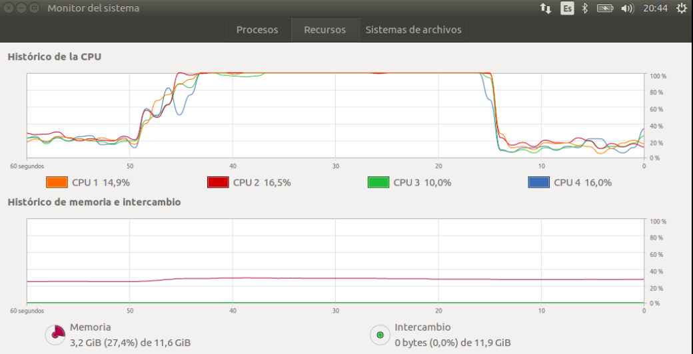

# PySpark: Cálculo del número PI

2018-03-18

En este ejercicio vamos a realizar el cálculo del valor del numero Pi (π).

El número Pi es uno de los más importantes de las matemáticas. Su valor equivale aproximadamente a 3,14159 y es una constante que se utiliza para calcular, entre otros, el perímetro y el área de un círulo a partir de su radio o de su diámetro.

Pi es un número irracional, lo que significa que se le pueden calcular un número infinito de decimales que ni siquiera tienen un patrón repetitivo. Esto hace que sea difícil calcular con precisión el valor de Pi, aunque no imposible.

**El método de Montecarlo**

El método de Montecarlo es un método muy común para estimar el valor de Pi mediante el uso de números aleatorios. 

Partiendo de un cuadrado de lado 1 y un círculo inscrito también de diámetrio 1, se generan un gran número de puntos aleatorios uniformemente distribuidos que se representan en la figura descrita.

Dividiendo el número de puntos que caen dentro del círculo entre el numero total de puntos, se obtiene valor Pi/4, y de éste el valor de Pi.

**Aplicando PySpark**

Para el cálculo de Pi utilizaremos Apache Spark y Python. Importaremos las librerías necesarias, iniciaremos contexto spark, ejecutaremos el proceso de cálculo con 100 millones de puntos generados aleatoriamente y al finalizar detendremos el contexto spark. Además, calcularemos y mostraremos el tiempo transcurrido.

## Redordemos

- Un **RDD** (Resilient Distributed Dataset) es una colección de elementos que pueden procesarse en paralelo.
- Sobre un RDD se pueden realizar operaciones de **transformación** y operaciones de **acción**.
- Las operaciones de **transformación** son perezosas, no se realizan mientras no se invoque una operación de **acción**.

## Nota importante

Si tras la instalación de Apache Spark y Jupyter Notebook no incluiste las variables de entorno en tu fichero ~/.bashrc, no olvides ejecutar las siguientes instrucciones antes de invocar _jupyter notebook_:
```
    export SPARK_HOME=/opt/spark
    export PATH=$SPARK_HOME/bin:$PATH
    export PYSPARK_DRIVER_PYTHON=jupyter
    export PYSPARK_DRIVER_PYTHON_OPTS='notebook'
```

```
    jupyter notebook
```
## Fuentes

[Tutorial Kart](https://www.tutorialkart.com)


```python
### Carga PySpark
import findspark
findspark.init()

### Carga algunas librerías adicionales que necesitaremos
import pyspark
import random
import time
```


```python
def inside(p):     
    x, y = random.random(), random.random()
    return x*x + y*y < 1

start_time = time.time()

num_samples = 100 * 1000 * 1000
sc = pyspark.SparkContext(appName="Pi")
count = sc.parallelize(range(0, num_samples)).filter(inside).count()
sc.stop()
pi = 4 * count / num_samples

end_time = time.time()

print('Valor de PI: %s' % pi)
print('Tiempo de cálculo: %.2f s.' % (end_time - start_time))
```

A continuación se muestra una imagen del monitor del sistema durante la ejecución del proceso.




```python

```
