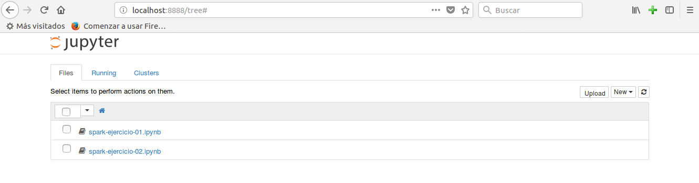
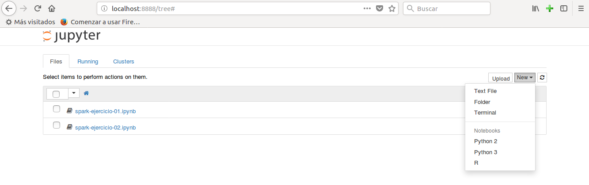

 Usar Apache Spark con Jupyter

En este artículo vamos a aprender a utilizar Apache Spark con Python y Jupyter Notebook.

Como sabemos, Jupyter Notebook es una aplicación web que permite crear y compartir documentos que pueden contener tanto código fuente como ecuaciones, visualizaciones y texto explicativo. Entre sus usos está la limpieza y transformación de datos, la simulación numérica, el modelado estadístico, el aprendizaje automático y mucho más.

> NOTA: se considera que ya se encuentran instalados en el sistema tanto Apache Spark como Python y su gestor de paquetes pip.

En primer lugar instalaremos Jupyter Notebook en nuestra máquina, si es que no lo tenemos ya instalado. Para ello basta con ejecutar por consola el siguiente comando: 

```
# Instalar Jupyter Notebook
pip install jupyter
```

Una vez instalado, Jupyter Notebook se puede arrancar, tambien desde consola, con el siguiente comando:

```
# Lanzar Jupyter Notebook
jupyter notebook
```



Desde el cliente web podemos crear un nuevo script python pulsando sobre el botón New y seleccionando la opción Python3 (o Python2, la que más nos guste) en el menú desplegable.




Hasta ahora sólo hemos visto cómo podemos utilizar Python con Jupyter Notebook, pero no Apache Spark. Nos falta dar un paso más, y este puede hacerse de dos maneras distintas:
- 1ª) Configurando el controlador de PySpark para que al ejecutar pyspark se abra Jupyter Notebook automáticamente.
- 2ª) Utilizando Jupyter Notebook de forma normal y cargando PySpark usando el paquete findSpark.

Veamos a continuación cada uno de los casos:

### 1 - Configurando pyspark para que abra Jupyter Notebook automáticamente.

Como hemos dicho anteriormente, una de las formas de utilizar Jupyter Notebook para trabajar con Apache Spark y Python es configurar el controlador de PySpark para que al ejecutar del comando pyspark desde consola se abra automáticamente un Jupyter Notebook.

Para poder hacerlo editaremos nuestro archivo ~/.bashrc y añadiremos al final un par de nuevas líneas:

```
# Editar ~/.bashrc
sudo nano ~/.bashrc
```

Líneas a añadir al fichero:

```
export PYSPARK_DRIVER_PYTHON=jupyter
export PYSPARK_DRIVER_PYTHON_OPTS='notebook'
```

Después reiniciaremos la consola o terminal y ejecutaremos el comando pyspark.


### 2 - Cargando el paquete findSpark desde un script Python en Jupyter Notebook.

_en construcción_


## Referencias

[Get Started with PySpark and Jupyter Notebook in 3 Minutes](https://blog.sicara.com/get-started-pyspark-jupyter-guide-tutorial-ae2fe84f594f)


